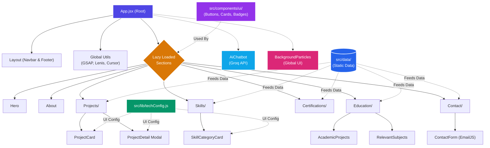

# Siratim Mustakim Chowdhury - Professional Portfolio

<div align="center">


**A modern, scalable, and responsive web portfolio designed to showcase my experience in full-stack development.**

[](https://siratim-portfolio.vercel.app/)
[](mailto:chysiratimmustakim@gmail.com)
[](https://www.linkedin.com/in/siratim-mustakim-chowdhury)
[](https://github.com/SiratimMChy)

</div>

---

## **Overview**

Welcome to my portfolio! I built this space not just to list my skills, but to showcase my passion for creating modern, high-performance web experiences. Every detail here—from the interactive animations to the custom AI assistant—was crafted with clean code, scalability, and an excellent user experience in mind. It's a true reflection of how I approach real-world software development.

## **What Makes This Portfolio Special?**

- **Built-in AI Assistant:** I integrated a custom AI chatbot (powered by the incredibly fast **Groq API**) right into the site! You can chat with it to learn more about my background, skills, and projects in real-time.
- **Immersive 3D & Animations:** Instead of a static page, I used **Framer Motion** and **GSAP** to add dynamic floating 3D cards, interactive particle backgrounds, and buttery-smooth scroll effects.
- **Responsive & Accessible:** Designed mobile-first using **Tailwind CSS**. It looks great on any screen size and is fully keyboard navigable because accessibility is a priority.
- **Glassmorphism & Theming:** A sleek, modern UI with a seamless dark and light mode toggle that feels premium, polished, and easy on the eyes.
- **Scalable Architecture:** Under the hood, the codebase is highly modular, DRY, and scalable. I’ve separated the static data from the UI components for effortless maintainability.

---

## **Core Features**

- **Theme Support:** Clean Dark and Light modes built with Tailwind CSS and glassmorphism.
- **AI Assistant:** A built-in chatbot powered by the Groq API that can answer questions about my background and projects.
- **Smooth Scrolling:** Uses Lenis to make page scrolling feel fluid and natural.
- **Contact Form:** Working contact form built with EmailJS so messages go straight to my inbox without a custom backend.
- **Animations:** Subtle scroll triggers and hover effects built with GSAP and Framer Motion.
- **Responsive Design:** Mobile-first layouts that adapt well to any screen size.

---

## **Technology Stack**

### **Frontend & Build Tools**
- **React 18**
- **Vite 5**
- **Tailwind CSS 3.4**

### **AI & Integrations**
- **Groq API (`groq-sdk`)**
- **React Markdown**
- **EmailJS (`@emailjs/browser`)**

### **State Management & Animation**
- **Framer Motion 12**
- **GSAP 3**
- **Swiper**
- **Lenis**

### **Utilities & Packages**
- **Radix UI / Lucide React / Boxicons**
- **clsx & tailwind-merge**

---

## **Why I Chose This Stack**

When planning this portfolio, I wanted it to be fast, interactive, and easy to maintain. I went with **React** and **Vite** as the core foundation because of the great developer experience and fast build times. For styling, **Tailwind CSS** was the obvious choice to handle the glassmorphism and theme toggling without writing messy custom CSS files.

Since I wanted the site to feel alive, I brought in **Framer Motion** for micro-interactions (like the hover effects on the skill cards) and **GSAP** for the heavier scroll animations. To make sure those scroll animations didn't feel janky, I hooked up **Lenis** to give the entire page a smooth, native-feeling scroll experience.

Finally, I wanted a few interactive features without spinning up a heavy backend. I used the **Groq API** for the AI chatbot because its response time is ridiculously fast, and **EmailJS** to handle the contact form submissions securely from the frontend.

---

## **Project Architecture**

The repository is modularly organized for maintainability and scalability. All core components are separated logically:

```text
src/
├── components/          # UI Sections and Layout Components
│   ├── AiChatbot/       # Groq-powered AI Assistant Chatbot
│   │   └── AiChatbot.jsx
│   ├── layout/          # Global layout components
│   │   ├── Footer/      # Modular global footer
│   │   │   ├── Footer.jsx
│   │   │   ├── FooterLinks.jsx
│   │   │   └── FooterSocials.jsx
│   │   └── Navbar/      # Modular responsive navigation
│   │       ├── Navbar.jsx
│   │       ├── DesktopMenu.jsx
│   │       ├── MobileMenu.jsx
│   │       ├── NavbarActions.jsx
│   │       ├── Logo.jsx
│   │       └── navLinks.js
│   ├── sections/        # Lazy-loaded page sections
│   │   ├── About/
│   │   │   └── About.jsx
│   │   ├── Certifications/
│   │   │   └── Certifications.jsx
│   │   ├── Contact/
│   │   │   ├── Contact.jsx
│   │   │   └── ContactForm.jsx
│   │   ├── Education/
│   │   │   ├── Education.jsx
│   │   │   ├── AcademicProjects.jsx
│   │   │   └── RelevantSubjects.jsx
│   │   ├── Experience/
│   │   │   └── Experience.jsx
│   │   ├── Hero/
│   │   │   ├── Hero.jsx
│   │   │   └── HeroContent.jsx
│   │   ├── Projects/
│   │   │   ├── Projects.jsx
│   │   │   ├── ProjectCard.jsx
│   │   │   └── ProjectDetail.jsx
│   │   └── Skills/
│   │       ├── Skills.jsx
│   │       └── SkillCategoryCard.jsx
│   └── ui/              # Reusable UI primitives
│       ├── BackgroundParticles.jsx
│       └── ... (buttons, cards, badges)
│
├── data/                # Extracted static data for cleaner components
│   ├── certificationsData.js # Static data for credentials
│   ├── contactData.js   # Contact info & social links
│   ├── educationData.js # Degrees & academic projects
│   ├── experienceData.js# Work history & responsibilities
│   ├── projectsData.js  # Project details, tech stacks & links
│   └── skillsData.js    # Technical skills & categories
│
├── lib/                 # Shared utilities and configurations
│   ├── chatbotPrompt.js # AI persona and system prompt configuration
│   ├── techConfig.js    # Centralized UI configuration for tech stack badges
│   └── utils.js         # clsx and tailwind-merge utilities
│
├── utils/               # Helper functions and logic handlers
│   ├── cursorEffects.js # Custom interactive cursor logic
│   ├── gsapAnimations.js# Global GSAP timeline sequences
│   ├── performanceMonitor.js # Metric tracking for optimizations
│   └── soundEffects.js  # Audio interactions
│
├── App.jsx              # Root layout, routing, and theme orchestration
├── main.jsx             # React DOM entry point
└── index.css            # Global styles and Tailwind configuration
```

### **Component Flow & Architecture**



---

## **Getting Started**

To run this project locally, ensure you have **Node.js (v18+)** installed.

1. **Clone the repository:**
   ```bash
   git clone https://github.com/SiratimMChy/My-Modern-Portfolio.git
   cd My-Modern-Portfolio
   ```

2. **Install dependencies:**
   ```bash
   npm install
   ```

3. **Configure Environment Variables:**
   Create a `.env` file in the root directory and add the following keys. You will need to obtain these from your respective EmailJS and Groq dashboards:

   | Variable | Description |
   |----------|-------------|
   | `VITE_EMAILJS_SERVICE_ID` | Your EmailJS Service ID for the contact form |
   | `VITE_EMAILJS_TEMPLATE_ID` | Your EmailJS Template ID for routing messages |
   | `VITE_EMAILJS_PUBLIC_KEY` | Your EmailJS Public Key for authentication |
   | `VITE_GROQ_API_KEY` | Your Groq Cloud API Key for the AI Chatbot |

4. **Start the development server:**
   ```bash
   npm run dev
   ```
   Navigate to `http://localhost:5173` in your browser.

---

## **Available Scripts**

- `npm run dev` - Starts the local development server with HMR.
- `npm run build` - Compiles and minifies the application for production.
- `npm run preview` - Previews the production build locally.
- `npm run lint` - Runs ESLint to check for code quality and formatting.

---

## **Deployment**

The application is configured and ready for modern hosting platforms like **Vercel** and **Firebase Hosting**.

To deploy to Vercel via CLI:
```bash
npm install -g vercel
vercel --prod
```
*Note: Make sure to add your EmailJS environment variables to your Vercel Project Settings before deploying!*

---

## **Recent Updates**

This project is actively maintained to ensure it remains cutting-edge and highly performant. Some recent additions and optimizations include:

- **Enhanced Micro-interactions**: The navigation active states now feature bold highlights, and CTA buttons (like "View Resume") have been polished with a custom sweep/shine CSS hover animation for a premium feel.
- **GSAP & CSS Synergy**: Resolved animation conflicts to ensure GSAP's scroll timelines and Tailwind's CSS transitions work in perfect harmony.
- **Optimized Lazy Loading**: Consolidated React `Suspense` boundaries in the main `App.jsx` orchestration layer to prevent jarring multiple loading spinners, providing a seamless initial load experience.
- **Build Optimization**: Vite and Rollup configurations have been tuned with custom manual chunking for lightning-fast Vercel production deployments.

---

## **License**

This project is strictly **NOT open source**. Please refer to the [LICENSE](./LICENSE) file for more details. Copying, reproducing, or distributing any part of this project's code, design, or assets for personal or commercial purposes is strictly prohibited.

---

## **Author**

**Siratim Mustakim Chowdhury**  
*Full Stack Web & Android Developer | MERN Stack Specialist*  
🎓 *BSc in Computer Science & Engineering, Leading University, Sylhet*

Feel free to reach out for collaborations or inquiries:

[](mailto:chysiratimmustakim@gmail.com)
[](https://www.linkedin.com/in/siratim-mustakim-chowdhury)
[](https://github.com/SiratimMChy)

---

<div align="center">
  <b>If you found this project helpful or inspiring, consider leaving a ⭐ on the repository!</b>
</div>
