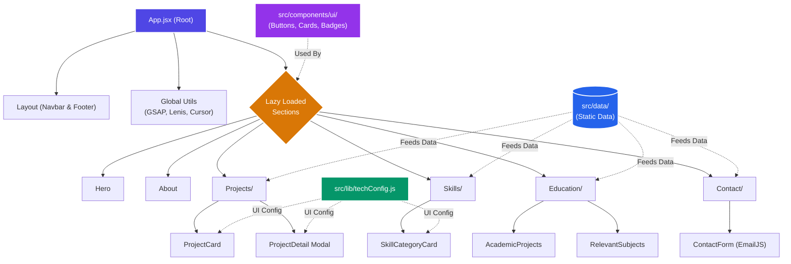

# 🚀 Siratim Mustakim Chowdhury - Professional Portfolio

<div align="center">


**A modern, scalable, and responsive web portfolio designed to showcase my experience in full-stack development.**

[](https://siratim-portfolio.vercel.app/)
[](mailto:chowdhurysiratimmustakim@gmail.com)
[](https://www.linkedin.com/in/siratim-mustakim-chowdhury)
[](https://github.com/SiratimMChy)

</div>

---

## 📌 Overview

This portfolio is built to demonstrate real-world implementation of modern frontend technologies. It prioritizes user experience, accessibility, and performance while maintaining a clean and professional design aesthetic. 

## ✨ Key Features

- **Groq-Powered AI Assistant:** A custom intelligent chatbot (`gpt-oss-120b`) integrated directly into the portfolio that acts as a professional assistant to answer questions about my background, skills, and projects.
- **Responsive & Accessible UI:** Designed with a mobile-first approach using Tailwind CSS. Fully keyboard navigable with semantic HTML and custom event handlers for interactive elements.
- **Advanced Animations & Particles:** Features reusable particle animations (`BackgroundParticles`), floating 3D tech stack cards, and declarative component transitions using Framer Motion and GSAP.
- **Dynamic Theming:** Seamless system-aware dark and light mode toggle with customized glassmorphism aesthetics.
- **Interactive Project Showcase:** Includes a detailed Swiper-powered project carousel and dynamic modals for deeper case study exploration.
- **Custom Utilities:** Features modular utilities for smooth scrolling (Lenis), custom cursor tracking, and performance monitoring.

---

## 🛠️ Technology Stack

### Frontend & Build Tools
- **React 18** (Functional Components & Hooks)
- **Vite 5** (Fast HMR & Optimized Build)
- **Tailwind CSS 3.4** (Utility-first Styling & Glassmorphism)

### AI & Integrations
- **Groq API (`groq-sdk`)** (Ultra-fast LLM inference)
- **React Markdown** (Rendering AI responses)
- **EmailJS** (`@emailjs/browser` for form submissions)

### State Management & Animation
- **Framer Motion 12** (Micro-interactions & page transitions)
- **GSAP 3** (ScrollTrigger & complex timelines)
- **Swiper** (Modern touch-slider for project galleries)
- **Lenis** (Smooth Scrolling)

### Utilities & Packages
- **Radix UI** / **Lucide React** / **Boxicons** (Icons & accessible primitives)
- **clsx & tailwind-merge** (Dynamic class handling)

---

## 📂 Project Architecture

The repository is modularly organized for maintainability and scalability. All core components are separated logically:

```text
src/
├── components/          # UI Sections and Layout Components
│   ├── AiChatbot.jsx    # Groq-powered AI Assistant Chatbot
│   ├── About.jsx        # Personal introduction
│   ├── Contact/         # Contact section
│   │   ├── Contact.jsx
│   │   └── ContactForm.jsx
│   ├── Education/       # Academic timeline & subjects
│   │   ├── Education.jsx
│   │   ├── AcademicProjects.jsx
│   │   └── RelevantSubjects.jsx
│   ├── Experience.jsx   # Professional work timeline
│   ├── Footer.jsx       # Global footer
│   ├── Hero.jsx         # Landing section with animations
│   ├── Navbar.jsx       # Responsive navigation
│   ├── Projects/        # Portfolio showcase
│   │   ├── Projects.jsx
│   │   ├── ProjectCard.jsx
│   │   └── ProjectDetail.jsx
│   ├── Skills/          # Technical skills
│   │   ├── Skills.jsx
│   │   └── SkillCategoryCard.jsx
│   └── ui/              # Reusable UI primitives
│       └── BackgroundParticles.jsx
│
├── data/                # Extracted static data for cleaner components
│   ├── contactData.js   # Contact info & social links
│   ├── educationData.js # Degrees & academic projects
│   ├── experienceData.js# Work history & responsibilities
│   ├── projectsData.js  # Project details, tech stacks & links
│   └── skillsData.js    # Technical skills & categories
│
├── lib/                 # Shared utilities and configurations
│   ├── chatbotPrompt.js # AI persona and system prompt configuration
│   ├── techConfig.js    # Centralized UI configuration for tech stack badges
│   └── utils.js         # clsx and tailwind-merge utilities
│
├── utils/               # Helper functions and logic handlers
│   ├── cursorEffects.js # Custom interactive cursor logic
│   ├── gsapAnimations.js# Global GSAP timeline sequences
│   ├── performanceMonitor.js # Metric tracking for optimizations
│   └── soundEffects.js  # Audio interactions
│
├── App.jsx              # Root layout, routing, and theme orchestration
├── main.jsx             # React DOM entry point
└── index.css            # Global styles and Tailwind configuration
```

### ⚙️ Component Flow & Architecture



---

## 🚀 Getting Started

To run this project locally, ensure you have **Node.js (v18+)** installed.

1. **Clone the repository:**
   ```bash
   git clone https://github.com/SiratimMChy/My-Modern-Portfolio.git
   cd My-Modern-Portfolio
   ```

2. **Install dependencies:**
   ```bash
   npm install
   ```

3. **Configure Environment Variables:**
   Create a `.env` file in the root directory for EmailJS integration. You will need to get these keys from your EmailJS dashboard:
   ```env
   VITE_EMAILJS_SERVICE_ID=your_service_id
   VITE_EMAILJS_TEMPLATE_ID=your_template_id
   VITE_EMAILJS_PUBLIC_KEY=your_public_key
   ```

4. **Start the development server:**
   ```bash
   npm run dev
   ```
   Navigate to `http://localhost:5173` in your browser.

---

## 📦 Available Scripts

- `npm run dev` - Starts the local development server with HMR.
- `npm run build` - Compiles and minifies the application for production.
- `npm run preview` - Previews the production build locally.
- `npm run lint` - Runs ESLint to check for code quality and formatting.

---

## 🌐 Deployment

The application is configured and ready for modern hosting platforms like **Vercel** and **Firebase Hosting**.

To deploy to Vercel via CLI:
```bash
npm install -g vercel
vercel --prod
```
*Note: Make sure to add your EmailJS environment variables to your Vercel Project Settings before deploying!*

---

## 👨‍💻 Author

**Siratim Mustakim Chowdhury**  
*Full Stack Web & Android Developer | MERN Stack Specialist*

Feel free to reach out for collaborations or inquiries:
- 📧 chowdhurysiratimmustakim@gmail.com
- 💼 [LinkedIn](https://www.linkedin.com/in/siratim-mustakim-chowdhury)
- 🐱 [GitHub](https://github.com/SiratimMChy)

---

<div align="center">
  <b>If you found this project helpful or inspiring, consider leaving a ⭐ on the repository!</b>
</div>
